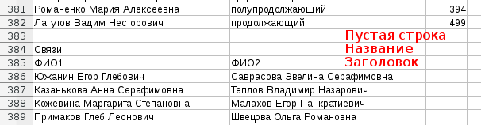

# grmaster

## License

    grmaster - tool for dividing students into groups
    Copyright (C) 2015  Lutov V. S. <vslutov@yandex.ru>

    This program is free software: you can redistribute it and/or modify
    it under the terms of the GNU Affero General Public License as published by
    the Free Software Foundation, either version 3 of the License, or
    (at your option) any later version.

    This program is distributed in the hope that it will be useful,
    but WITHOUT ANY WARRANTY; without even the implied warranty of
    MERCHANTABILITY or FITNESS FOR A PARTICULAR PURPOSE.  See the
    GNU Affero General Public License for more details.

    You should have received a copy of the GNU Affero General Public License
    along with this program.  If not, see <http://www.gnu.org/licenses/>.

## Введение

Программа `grmaster` предназначена для удобного и быстрого распределения
студентов первого курса на группы с учетом их пожеланий и уровня английского.

Программа писалась для факультета ВМК и учитывает его специфику.

- В каждой группе две английские подгруппы, которые могут быть как одного
  уровня знаний, так и разных.
- Все английские подгруппы и академические группы примерно одинакового
  размера.
- На каждом потоке свое количество групп, примерно одинакового размера.
- Потоки принципиально ничем не отличаются (разве что, студент может захотеть
  на какой-то конкретный поток.

Если у вас другие требования для распределения, то меняйте код программы так,
как вам нужно, в рамках соблюдения лицензии GNU AGPL. Подробнее о коде
читайте в разделе [для программистов](#for-programmers).

В случае возникновения проблем, пишите автору:
Владимир Лютов <mailto:vslutov@yandex.ru>.

## Быстрый старт

Если не хотите заморачиваться с установкой - откройте эту ссылку
[http://lutov.net/grmaster](http://lutov.net/grmaster) и переходите к
пункту [использование](#using).

Если вы по каким-то причинам, решили настроить свой сервер или запустить
приложение из консоли, то все равно прочитайте раздел
[использование](#using), а потом переходите в раздел
[для программистов](#for-programmers).

## Использование

Итак, перед вами интерфейс веб-сервера, который обрабатывает информацию,
которую вы в него загрузите. Процесс автоматического распределения состоит из
4 шагов.

1. Загрузка шаблона на ваш компьютер.
2. Добавление информации о студентах в шаблон (делается в табличном редакторе).
3. Загрузка данных на сервер для обработки.
4. Получение результата с сервера.

Рассмотрим этот процесс по шагам.

### Загрузка шаблона

Нажмите кнопку `Cкачать шаблон`.

### Добавление информации о студентах

Шаблон - это табличный файл в формате
[.csv](https://ru.wikipedia.org/wiki/CSV). Редактировать его удобно табличным
редактором Microsoft Excel или LibreOffice Calc. Если у вас нет табличного
редактора, можете бесплатно загрузить офисный пакет LibreOffice с сайта
разработчика: <https://www.libreoffice.org/download/libreoffice-fresh/>.

Файл с информацией содержит (в порядке сверху-вниз):

1. Настройки для `grmaster`.
2. Одна пустая строка.
3. Заголовок для таблицы студентов.
4. Таблица студентов.
5. Еще одна пустая строка.
6. Несколько дополнительных таблиц, разделенных одной строкой.

Настройки можно менять так, как вам нужно - программа сама подстроится под
вас.

Доступные настройки:

- `streams_info` - количество групп на потоке (набор чисел в разных столбцах
  таблицы)
- `english_header` - название столбца, в котором находится информация об
  уровне английского каждого студента
- `english_per_group` - количество английских подгрупп в одной группе
- `score_header` - название столбца с баллами студента
- `connection_table` - название таблицы со связями между студентами (смотри
  далее)
- `stream_tables` - названия таблиц со списком студентов, хотящих попасть
  на каждый из потоков

В каждой таблице все столбцы должны быть подписаны в заголовке (первой
строке после пустой строки).

Первый столбец в каждой таблице - это полное имя студента. Должно быть
уникальным. Если на курсе есть полные тезки, снабдите их имена числовыми
идентификаторами.

Для таблицы студентов желательно указать их суммарный или средний балл.
Студенты с одним уровнем английского должны иметь одинаковые значения в
поле `english_header`.

Все дополнительные таблицы должны отделяться от предыдущей ровно одной
пустой строкой. У них должны быть название и заголовок.

Например:

Поддерживаемые таблицы:
- Таблица со списком пар студентов, которые хотят учиться в одной группе.
- Таблицы со списком студентов, желающих попасть на первый, второй и третий
  потоки. Таблицы могут быть пустыми, но заголовки лучше бы были.

Заполните этот файл в соответсвии с вашими потребностями.

### Загрузка данных на сервер

После того, как вы добавили в шаблон нужную информацию, сохраните его в формате
`.csv` **(ВАЖНО: `grmaster` понимает только этот формат, не пытайтесь
загрузить `.ods` или `.xlsx`, ничего хорошего у вас не получится)**.

Загрузите готовую таблицу на сервер с помощью соответсвующего элемента
интерфейса.

### Получение результата

Скачайте результат.

Поздравляем! Вы получили очень хорошее распределение по группам для студентов
первого курса. Возвращайтесь к нам через год и рекомендуйте это приложения
своим знакомым с других факультетов.

## Для программистов

Итак, `grmaster` - это приложение на чистом python 3. Просто несколько файлов
с расширением `.py`, объединенные в одну папку.

### Зависимости

- Flask
- pytest

### Как использовать?

Есть два пути общения с вычислительным ядром программы.

1. *Рекомендуется* через браузер.
2. Через консоль команда `grmaster`. Интуитивный интерфейс `grmaster help`.

### Как установить?

Установка предполагает несколько взаимозаменяющих вариантов в зависимости от
того, чего вы хотите.

1. *Рекомендуется* установка с помощью [Docker](https://www.docker.com/).
2. Установка из pypi.
3. Установка из исходных кодов.

Установка с помощью Docker удобна, если вы говорите на русском и кроме
веб-интерфейса на собственном сервере вам ничего не нужно.

1. Установите Docker.
2. `docker pull vslutov/grmaster`
3. `docker run -d -p [номер порта]:8000 vslutov/grmaster`

Установка из pypi удобна, если вам нужна обработка файлов в консоли или вы
не хотите использовать docker.

1. `pip install grmaster`
2. `grmaster test`

Установка из исходных кодов удобна, если вы хотите поменять настройки
сервера (порт, на котором он работает или язык).

1. Скачайте репозиторий
   [https://github.com/vslutov/grmaster](https://github.com/vslutov/grmaster)
2. `python setup.py develop` **или** `python setup.py install`

### Как перевести на новый язык?

Просто переведите `grmaster/data/index.en.html` на ваш язык, сохраните в
формате `index.LANG.html` в ту же папку и поменяйте настройки в файле
`grmaster/setting.py`.

Сделайте, пожалуйста, после этого pull-request с переводом на github или
напишите автору письмо <mailto:vslutov@yandex.ru> с приложенным переводом,
чтобы вашими наработками могли пользоваться другие люди.

### Как добавить новый функционал?

Вопрос?
